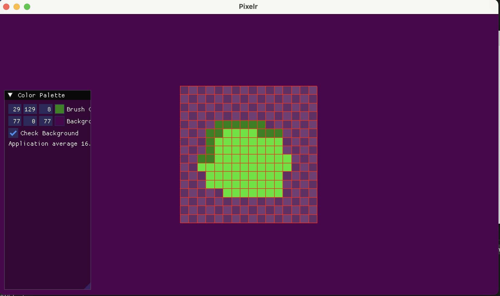

# Pixel art drawing program

A Pixel art drawing program

Uses OpenGL 3.3 and SDL for platform layer.

 

## Backups on Crash 

If the program crashes and you lose your progress, backup files are saved every minute and are stored in this location on your device:
https://wiki.libsdl.org/SDL2/SDL_GetPrefPath

## Goals
- [ ] Rewrite the GUI without using Dear IMGUI
- [ ] Remove C runtime library
- [ ] Build for Web using WASM
- [ ] Build natively for Mac & Windows

## WHY's
- [x] Fun & Challenging to program
- [x] Get as good as I can at programming
- [x] Add to my projects list
- [x] Build confidence

## Building on Mac OS
run ```./run.sh``` to build and run the program. 

